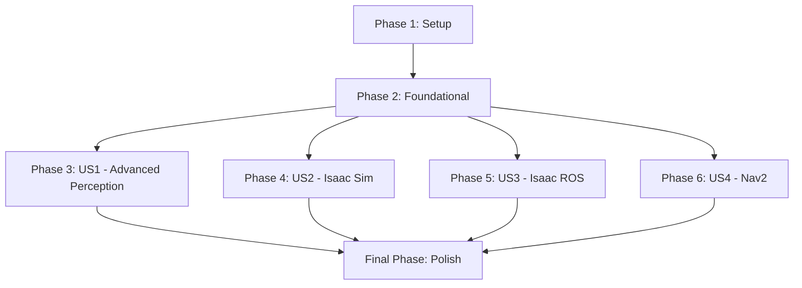

# Tasks for Module 3 - The AI-Robot Brain (NVIDIA Isaac)

**Feature Branch**: `006-module3-ai-robot-brain`
**Date**: 2025-12-05
**Implementation Plan**: [specs/006-module3-ai-robot-brain/plan.md](specs/006-module3-ai-robot-brain/plan.md)
**Feature Specification**: [specs/006-module3-ai-robot-brain/spec.md](specs/006-module3-ai-robot-brain/spec.md)

This document outlines the tasks required to implement Module 3, "The AI-Robot Brain (NVIDIA Isaac)", within the Docusaurus project. Tasks are organized by phase, with User Story phases reflecting the priorities defined in the feature specification.

## Phase 1: Setup

*Independent Test: Verify that the basic directory structure and Docusaurus configuration for Module 3 are in place and recognized by the Docusaurus development server.*

- [X] T001 Create the main directory for Module 3 chapters: `docs/module3-ai-robot-brain/`
- [X] T002 Create the `_category_.json` file for Module 3: `docs/module3-ai-robot-brain/_category_.json`
- [X] T003 Create the directory for Module 3 examples: `examples/module3/`
- [X] T004 Create subdirectories for Isaac Sim scenes: `examples/module3/isaac-sim-scenes/`
- [X] T005 Create subdirectories for VSLAM pipelines: `examples/module3/vslam-pipelines/`
- [X] T006 Create subdirectories for Nav2 configurations: `examples/module3/nav2-configurations/`
- [X] T007 Create subdirectories for perception graphs: `examples/module3/perception-graphs/`
- [X] T008 Create the directory for Module 3 images/assets: `static/img/module3/`
- [X] T009 Update Docusaurus `sidebars.ts` to include Module 3: `sidebars.ts`

## Phase 2: Foundational

*Independent Test: Verify that the Docusaurus build process successfully recognizes the new module and its basic structure without frontmatter validation errors, and that custom MDX components are importable.*

- [ ] T010 Verify existing JSON Schema for frontmatter metadata or define a new one if necessary, ensuring it can validate Module 3 chapter frontmatter: `src/plugins/chapter-validation/schema.json` (or similar)
- [ ] T011 Confirm availability and correct import paths for custom MDX components (`LearningObjectives`, `KeyTakeaways`, `Prerequisites`, `ExerciseBlock`): `src/components/` and `src/theme/MDXComponents.ts`

## Phase 3: User Story 1 - Learning about Advanced Perception and Synthetic Data (P1)

*Story Goal: Understand advanced perception concepts and the role of synthetic data in training robotic AI.*
*Independent Test: Chapter 1 can be accessed, read, and its content (including custom components) renders correctly in the Docusaurus development server. A quiz on its content can be generated and answered.*

- [X] T012 [P] [US1] Create MDX file for Chapter 1: `docs/module3-ai-robot-brain/01-focus-advanced-perception-and-synthetic-data.mdx`
- [X] T013 [US1] Add frontmatter metadata to Chapter 1, adhering to schema: `docs/module3-ai-robot-brain/01-focus-advanced-perception-and-synthetic-data.mdx`
- [X] T014 [US1] Populate Chapter 1 content, integrating `LearningObjectives`, `KeyTakeaways`, `Prerequisites`, and `ExerciseBlock` components: `docs/module3-ai-robot-brain/01-focus-advanced-perception-and-synthetic-data.mdx`

## Phase 4: User Story 2 - Simulating and Training in Isaac Sim (P2)

*Story Goal: Learn how to use NVIDIA Isaac Sim for photorealistic simulation and training.*
*Independent Test: Chapter 2 can be accessed, read, and its content (including custom components and references to Isaac Sim examples) renders correctly. An Isaac Sim example scene can be loaded and run as per chapter instructions.*

- [X] T015 [P] [US2] Create MDX file for Chapter 2: `docs/module3-ai-robot-brain/02-isaac-sim-for-photorealistic-simulation-and-training.mdx`
- [X] T016 [US2] Add frontmatter metadata to Chapter 2, adhering to schema: `docs/module3-ai-robot-brain/02-isaac-sim-for-photorealistic-simulation-and-training.mdx`
- [X] T017 [US2] Populate Chapter 2 content, integrating custom MDX components: `docs/module3-ai-robot-brain/02-isaac-sim-for-photorealistic-simulation-and-training.mdx`
- [ ] T018 [P] [US2] Create example Isaac Sim scene files and place them in `examples/module3/isaac-sim-scenes/`: `examples/module3/isaac-sim-scenes/`
- [X] T019 [US2] Reference Isaac Sim example scenes from Chapter 2 content: `docs/module3-ai-robot-brain/02-isaac-sim-for-photorealistic-simulation-and-training.mdx`

## Phase 5: User Story 3 - Implementing VSLAM and Navigation with Isaac ROS (P3)

*Story Goal: Learn how to use Isaac ROS for GPU-accelerated VSLAM and navigation.*
*Independent Test: Chapter 3 can be accessed, read, and its content (including custom components and references to Isaac ROS examples) renders correctly. An Isaac ROS VSLAM pipeline and Nav2 configuration can be run and verified.*

- [X] T020 [P] [US3] Create MDX file for Chapter 3: `docs/module3-ai-robot-brain/03-isaac-ros-for-gpu-accelerated-vslam-and-navigation.mdx`
- [X] T021 [US3] Add frontmatter metadata to Chapter 3, adhering to schema: `docs/module3-ai-robot-brain/03-isaac-ros-for-gpu-accelerated-vslam-and-navigation.mdx`
- [X] T022 [US3] Populate Chapter 3 content, integrating custom MDX components: `docs/module3-ai-robot-brain/03-isaac-ros-for-gpu-accelerated-vslam-and-navigation.mdx`
- [ ] T023 [P] [US3] Create VSLAM pipeline configuration files: `examples/module3/vslam-pipelines/`
- [ ] T024 [P] [US3] Create Nav2 configuration block files: `examples/module3/nav2-configurations/`
- [ ] T025 [P] [US3] Create perception graph examples: `examples/module3/perception-graphs/`
- [X] T026 [US3] Reference VSLAM pipelines, Nav2 configurations, and perception graphs from Chapter 3 content: `docs/module3-ai-robot-brain/03-isaac-ros-for-gpu-accelerated-vslam-and-navigation.mdx`

## Phase 6: User Story 4 - Humanoid Path Planning with Nav2 (P4)

*Story Goal: Learn how to use Nav2 for humanoid path planning and locomotion.*
*Independent Test: Chapter 4 can be accessed, read, and its content (including custom components and references to Nav2 examples) renders correctly. A Nav2-based path planning exercise for a humanoid robot can be completed in simulation.*

- [X] T027 [P] [US4] Create MDX file for Chapter 4: `docs/module3-ai-robot-brain/04-nav2-for-humanoid-path-planning-and-locomotion.mdx`
- [X] T028 [US4] Add frontmatter metadata to Chapter 4, adhering to schema: `docs/module3-ai-robot-brain/04-nav2-for-humanoid-path-planning-and-locomotion.mdx`
- [X] T029 [US4] Populate Chapter 4 content, integrating custom MDX components and structured exercises for deploying AI behaviors to a Jetson Orin: `docs/module3-ai-robot-brain/04-nav2-for-humanoid-path-planning-and-locomotion.mdx`
- [X] T030 [US4] Ensure examples for deploying AI behaviors to Jetson Orin are in place and referenced: `examples/module3/` and `docs/module3-ai-robot-brain/04-nav2-for-humanoid-path-planning-and-locomotion.mdx`

## Final Phase: Polish & Cross-Cutting Concerns

*Independent Test: The entire Docusaurus site builds without errors, all new Module 3 content is accessible, correctly formatted, and links are functional.*

- [X] T031 Review all Module 3 MDX chapters for adherence to Docusaurus MDX format and project content standards: `docs/module3-ai-robot-brain/`
- [X] T032 Ensure all images and static assets referenced in Module 3 chapters are present in `static/img/module3/`: `static/img/module3/`
- [X] T033 Run a full Docusaurus build to validate all content, frontmatter, and links for Module 3: Project Root
- [X] T034 Verify that the Module 3 heading "The AI-Robot Brain (NVIDIA Isaac)" is correctly displayed in the sidebar and chapter pages: `docs/module3-ai-robot-brain/_category_.json`

## Dependency Graph

## Parallel Execution Examples

- **Example 1**: After Phase 2 is complete, different contributors can work on populating the content for each user story (Phase 3, 4, 5, and 6) in parallel, as each is designed to be an independently testable increment.
- **Example 2**: Within each User Story phase, tasks marked with `[P]` (e.g., creating the MDX file and creating associated example files) can often be performed in parallel by different contributors or as separate subtasks.

## Implementation Strategy

The implementation will follow an iterative approach, delivering each user story as a functionally complete and independently testable increment. User Story 1 (Advanced Perception) will serve as the initial Minimum Viable Product (MVP) for content, ensuring the core content generation and Docusaurus integration process is sound before proceeding with more complex Isaac Sim/ROS specific content. This strategy allows for early feedback and reduces integration risks.
