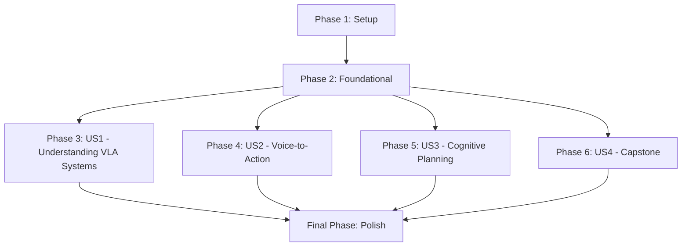

# Tasks for Module 4 - Vision-Language-Action (VLA)

**Feature Branch**: `007-module4-vla`
**Date**: 2025-12-05
**Implementation Plan**: [specs/007-module4-vla/plan.md](specs/007-module4-vla/plan.md)
**Feature Specification**: [specs/007-module4-vla/spec.md](specs/007-module4-vla/spec.md)

This document outlines the tasks required to implement Module 4, "Vision-Language-Action (VLA)", within the Docusaurus project. Tasks are organized by phase, with User Story phases reflecting the priorities defined in the feature specification.

## Phase 1: Setup

*Independent Test: Verify that the basic directory structure and Docusaurus configuration for Module 4 are in place and recognized by the Docusaurus development server.*

- [ ] T001 Create the main directory for Module 4 chapters: `docs/007-module4-vla/`
- [ ] T002 Create the `_category_.json` file for Module 4: `docs/007-module4-vla/_category_.json`
- [ ] T003 Create the directory for Module 4 examples: `examples/module4/`
- [ ] T004 Create subdirectories for Whisper inference examples: `examples/module4/whisper-inference/`
- [ ] T005 Create subdirectories for LLM planning prompts: `examples/module4/llm-planning-prompts/`
- [ ] T006 Create subdirectories for vision graphs: `examples/module4/vision-graphs/`
- [ ] T007 Create subdirectories for VLA pipelines: `examples/module4/vla-pipelines/`
- [ ] T008 Create the directory for Module 4 images/assets: `static/img/module4/`
- [ ] T009 Update Docusaurus `sidebars.ts` to include Module 4: `sidebars.ts`

## Phase 2: Foundational

*Independent Test: Verify that the Docusaurus build process successfully recognizes the new module and its basic structure without frontmatter validation errors, and that custom MDX components are importable.*

- [ ] T010 Verify existing JSON Schema for frontmatter metadata or define a new one if necessary, ensuring it can validate Module 4 chapter frontmatter: `src/plugins/chapter-validation/schema.json` (or similar)
- [ ] T011 Confirm availability and correct import paths for custom MDX components (`LearningObjectives`, `KeyTakeaways`, `Prerequisites`, `ExerciseBlock`): `src/components/` and `src/theme/MDXComponents.ts`

## Phase 3: User Story 1 - Understanding VLA Systems and LLM-Robot Convergence (P1)

*Story Goal: Understand how Vision-Language-Action (VLA) systems work and the convergence of LLMs with robotics.*
*Independent Test: Chapter 1 can be accessed, read, and its content (including custom components) renders correctly in the Docusaurus development server. A quiz on its content can be generated and answered.*

- [ ] T012 [P] [US1] Create MDX file for Chapter 1: `docs/007-module4-vla/01-focus-the-convergence-of-llms-and-robotics.mdx`
- [ ] T013 [US1] Add frontmatter metadata to Chapter 1, adhering to schema: `docs/007-module4-vla/01-focus-the-convergence-of-llms-and-robotics.mdx`
- [ ] T014 [US1] Populate Chapter 1 content, integrating `LearningObjectives`, `KeyTakeaways`, `Prerequisites`, and `ExerciseBlock` components: `docs/007-module4-vla/01-focus-the-convergence-of-llms-and-robotics.mdx`

## Phase 4: User Story 2 - Implementing Voice-to-Action with OpenAI Whisper (P2)

*Story Goal: Learn how to convert voice commands into actionable text using OpenAI Whisper.*
*Independent Test: Chapter 2 can be accessed, read, and its content (including custom components and references to Whisper examples) renders correctly. A Whisper example can be run to transcribe audio accurately.*

- [ ] T015 [P] [US2] Create MDX file for Chapter 2: `docs/007-module4-vla/02-voice-to-action-using-whisper.mdx`
- [ ] T016 [US2] Add frontmatter metadata to Chapter 2, adhering to schema: `docs/007-module4-vla/02-voice-to-action-using-whisper.mdx`
- [ ] T017 [US2] Populate Chapter 2 content, integrating custom MDX components: `docs/007-module4-vla/02-voice-to-action-using-whisper.mdx`
- [ ] T018 [P] [US2] Create Whisper inference example files and place them in `examples/module4/whisper-inference/`: `examples/module4/whisper-inference/`
- [ ] T019 [US2] Reference Whisper inference examples from Chapter 2 content: `docs/007-module4-vla/02-voice-to-action-using-whisper.mdx`

## Phase 5: User Story 3 - Cognitive Planning with LLMs for ROS 2 Task Decomposition (P3)

*Story Goal: Learn how LLMs can be used for cognitive planning to decompose natural language commands into ROS 2 robot intentions.*
*Independent Test: Chapter 3 can be accessed, read, and its content (including custom components and references to LLM planning/vision examples) renders correctly. An LLM planning example generates valid ROS 2 intentions; a vision graph identifies objects correctly.*

- [ ] T020 [P] [US3] Create MDX file for Chapter 3: `docs/007-module4-vla/03-cognitive-planning-using-llms-for-ros2-task-decomposition.mdx`
- [ ] T021 [US3] Add frontmatter metadata to Chapter 3, adhering to schema: `docs/007-module4-vla/03-cognitive-planning-using-llms-for-ros2-task-decomposition.mdx`
- [ ] T022 [US3] Populate Chapter 3 content, integrating custom MDX components: `docs/007-module4-vla/03-cognitive-planning-using-llms-for-ros2-task-decomposition.mdx`
- [ ] T023 [P] [US3] Create LLM planning prompt examples: `examples/module4/llm-planning-prompts/`
- [ ] T024 [P] [US3] Create vision graph examples: `examples/module4/vision-graphs/`
- [ ] T025 [US3] Reference LLM planning prompts and vision graphs from Chapter 3 content: `docs/007-module4-vla/03-cognitive-planning-using-llms-for-ros2-task-decomposition.mdx`

## Phase 6: User Story 4 - Capstone: Building an Autonomous Humanoid (P4)

*Story Goal: Integrate navigation, perception, and manipulation to build a full Vision-Language-Action loop for an autonomous humanoid robot in simulation.*
*Independent Test: The Capstone chapter (Chapter 4) renders correctly, and a simulated humanoid robot successfully executes a VLA task from voice instruction, demonstrating speech-to-text, planning, navigation, perception, and manipulation.*

- [ ] T026 [P] [US4] Create MDX file for Chapter 4: `docs/007-module4-vla/04-capstone-the-autonomous-humanoid.mdx`
- [ ] T027 [US4] Add frontmatter metadata to Chapter 4, adhering to schema: `docs/007-module4-vla/04-capstone-the-autonomous-humanoid.mdx`
- [ ] T028 [US4] Populate Chapter 4 content, integrating custom MDX components and structured exercises for building a full VLA loop: `docs/007-module4-vla/04-capstone-the-autonomous-humanoid.mdx`
- [ ] T029 [P] [US4] Create example VLA pipeline files: `examples/module4/vla-pipelines/`
- [ ] T030 [US4] Reference VLA pipeline examples and structured exercises from Chapter 4 content: `docs/007-module4-vla/04-capstone-the-autonomous-humanoid.mdx`

## Final Phase: Polish & Cross-Cutting Concerns

*Independent Test: The entire Docusaurus site builds without errors, all new Module 4 content is accessible, correctly formatted, and links are functional.*

- [ ] T031 Review all Module 4 MDX chapters for adherence to Docusaurus MDX format and project content standards: `docs/007-module4-vla/`
- [ ] T032 Ensure all images and static assets referenced in Module 4 chapters are present in `static/img/module4/`: `static/img/module4/`
- [ ] T033 Run a full Docusaurus build to validate all content, frontmatter, and links for Module 4: Project Root
- [ ] T034 Verify that the Module 4 heading "Vision-Language-Action (VLA)" is correctly displayed in the sidebar and chapter pages: `docs/007-module4-vla/_category_.json`

## Dependency Graph

## Parallel Execution Examples

- **Example 1**: After Phase 2 is complete, different contributors can work on populating the content for each user story (Phase 3, 4, 5, and 6) in parallel, as each is designed to be an independently testable increment.
- **Example 2**: Within each User Story phase, tasks marked with `[P]` (e.g., creating the MDX file and creating associated example files) can often be performed in parallel by different contributors or as separate subtasks.

## Implementation Strategy

The implementation will follow an iterative approach, delivering each user story as a functionally complete and independently testable increment. User Story 1 (Understanding VLA Systems) will serve as the initial Minimum Viable Product (MVP) for content, ensuring the core content generation and Docusaurus integration process is sound before proceeding with more complex VLA system components. This strategy allows for early feedback and reduces integration risks.
