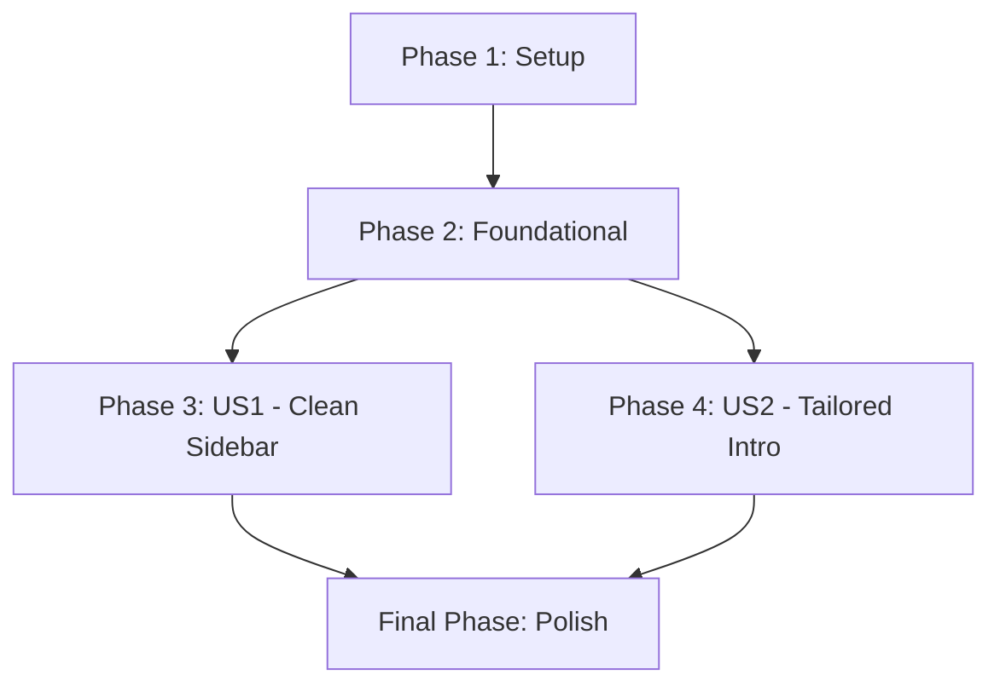

# Tasks for Docusaurus Sidebar and Introduction Update

**Feature Branch**: `008-sidebar-intro-update`
**Date**: 2025-12-05
**Implementation Plan**: [specs/008-sidebar-intro-update/plan.md](specs/008-sidebar-intro-update/plan.md)
**Feature Specification**: [specs/008-sidebar-intro-update/spec.md](specs/008-sidebar-intro-update/spec.md)

This document outlines the tasks required to update the Docusaurus sidebar and introductory content. Tasks are organized by phase, with User Story phases reflecting the priorities defined in the feature specification.

## Phase 1: Setup

*Independent Test: Confirm identification of key Docusaurus configuration files and content directories.*

- [ ] T001 Identify the `sidebars.ts` configuration file: `sidebars.ts`
- [ ] T002 Identify existing module directories that need `_category_.json` updates: `docs/module1-robotic-nervous-system/`, `docs/module2-the-digital-twin/`, `docs/006-module3-ai-robot-brain/`, `docs/007-module4-vla/`

## Phase 2: Foundational

*Independent Test: Verify the `intro.md` file exists with correct frontmatter and that `_category_.json` files for modules are correctly configured for autogeneration.*

- [ ] T003 Create the introductory content MDX file (`docs/intro.md`) with correct frontmatter (`id: intro`, `title: Introduction`, `sidebar_position: 1`, `slug: /`): `docs/intro.md`
- [ ] T004 For `docs/module1-robotic-nervous-system/`, ensure or create `_category_.json` with appropriate `label` and `position`: `docs/module1-robotic-nervous-system/_category_.json`
- [ ] T005 For `docs/module2-the-digital-twin/`, ensure or create `_category_.json` with appropriate `label` and `position`: `docs/module2-the-digital-twin/_category_.json`
- [ ] T006 For `docs/006-module3-ai-robot-brain/`, ensure or create `_category_.json` with appropriate `label` and `position`: `docs/006-module3-ai-robot-brain/_category_.json`
- [ ] T007 For `docs/007-module4-vla/`, ensure or create `_category_.json` with appropriate `label` and `position`: `docs/007-module4-vla/_category_.json`

## Phase 3: User Story 1 - Clean and Structured Sidebar for Book Navigation (P1)

*Story Goal: The Docusaurus sidebar displays only the book's custom, hierarchical structure, with modules and chapters correctly organized, and no default or irrelevant items.*
*Independent Test: Launch Docusaurus dev server and visually inspect the sidebar. It should be clean, contain only book content, and allow correct navigation through modules and chapters.*

- [ ] T008 [P] [US1] Modify `sidebars.ts` to define the main sidebar: `sidebars.ts`
- [ ] T009 [US1] Remove all default/placeholder navigation items from `sidebars.ts`: `sidebars.ts`
- [ ] T010 [US1] Add `docs/intro.md` as the first item in the sidebar configuration: `sidebars.ts`
- [ ] T011 [US1] Configure each module directory (`module1-robotic-nervous-system`, `module2-the-digital-twin`, `006-module3-ai-robot-brain`, `007-module4-vla`) as an `autogenerated` type in `sidebars.ts`: `sidebars.ts`

## Phase 4: User Story 2 - Accurate and Tailored Introductory Content (P1)

*Story Goal: Readers access an accurate and engaging introductory section specifically tailored for the course book.*
*Independent Test: Launch Docusaurus dev server, navigate to the introductory page, and verify its content matches the specified requirements for outline, authors, and prerequisites.*

- [ ] T012 [P] [US2] Populate `docs/intro.md` with a high-level course outline: `docs/intro.md`
- [ ] T013 [P] [US2] Populate `docs/intro.md` with author introductions: `docs/intro.md`
- [ ] T014 [P] [US2] Populate `docs/intro.md` with prerequisites for the entire course: `docs/intro.md`
- [ ] T015 [US2] Ensure `docs/intro.md` clearly states the book's purpose, scope, learning objectives, author credentials, and necessary foundational knowledge: `docs/intro.md`

## Final Phase: Polish & Cross-Cutting Concerns

*Independent Test: The entire Docusaurus site builds successfully without errors, all new sidebar and introductory content is accessible, correctly formatted, and links are functional. The temporary file is removed.*

- [ ] T016 Run a full Docusaurus build to validate all sidebar configurations, frontmatter, and links: Project Root
- [ ] T017 Visually inspect the rendered Docusaurus site to confirm the sidebar is clean, hierarchical, and correctly navigates to all modules and chapters: Live site/local preview
- [ ] T018 Visually inspect the introductory page (`/`) to confirm its content is accurate, complete, and engaging as specified: Live site/local preview
- [ ] T019 Remove the temporary feature description file: `sidebar_feature_description.txt`

## Dependency Graph

## Parallel Execution Examples

-   **Example 1**: Tasks T004-T007 in Phase 2 (ensuring `_category_.json` for modules) can be done in parallel if different individuals are responsible for different modules.
-   **Example 2**: Tasks T012-T014 in Phase 4 (populating `docs/intro.md`) can be split among content creators working on different sections of the introduction.
-   **Example 3**: Within Phase 3, tasks T008-T011 can be tackled sequentially within the `sidebars.ts` file, but the preparatory work in Phase 2 makes sure all necessary inputs are ready.

## Implementation Strategy

The implementation will proceed by first preparing the necessary content files (`docs/intro.md` and `_category_.json` for modules). Once these foundational content pieces are in place, the `sidebars.ts` will be updated to reflect the new desired structure using Docusaurus's autogenerated sidebar feature. Finally, the introductory content will be populated. This approach ensures that the structural elements are correctly configured before populating the detailed content, minimizing integration issues. The two user stories have equal priority (P1) and can largely be developed in parallel after foundational setup.
